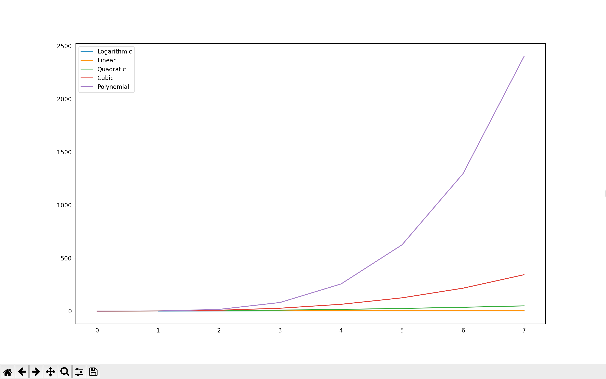

# Assignment 1
Plot the following equations in the same plot and write a report (.md file) explaining which one is the
best
1. Logarithmic = θ(log n)
2. Linear = θ(n)
3. Quadratic = θ(n^2)
4. Cubic = θ(n^3)
5. Polynomial = θ(n^k)

Input Values: n=7, k=4
  
# Solution 

From the above graph it is evident that Logarithmic provides the best complexity which requires minimum time and space.
